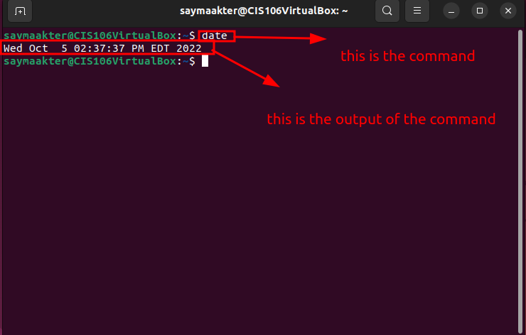
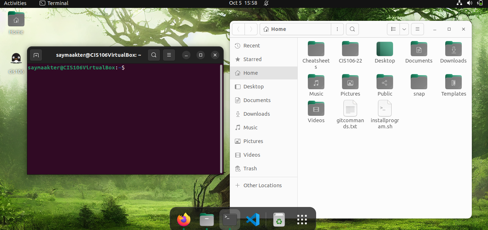

# Lab 3 Submission

## Question
Has no submission

## Question 2

## Question 3

| Program purpose     | Package Name     | Version                  |
| ------------------- | ---------------- | ------------------------ |
| Play a tetris game  | blockattack      | 2.7.0-1 amd64            |
| Play a video file   | dragonplayer     | 4:21.12.3-0ubuntu1 amd64 |
| Browse the internet | epiphany-browser | 42.4-0ubuntu1 amd64      |
| Read your email     | alpine-doc       | 2.25+dfsg1-1build1 all   |
| Play music          | asc-music        | 1.3-6 all                |

# Challenge

1. Install the programs that you found using a single command. Which command did you use?
sudo apt search
2. Remove all the programs that you installed in a single command. Which command did you use?
sudo apt install/remove 'package name here'
3. If you were to install the first and second program, but remove the other 3 in a single command, Which command will you use?
sudo apt install package+ package-

# Question 4
| command | what it does                       |
| ------- | ---------------------------------- |
| echo    | displays a line of text            |
| fortune | no manual entry for fotune         |
| cowsay  | no manual entry for cowsay         |
| lolcat  | no manual entry for lolcat         |
| figlet  | no manual entry for figlet         |
| toilet  | display large colourful characters |
| rig     | no manual entry for rig            |
