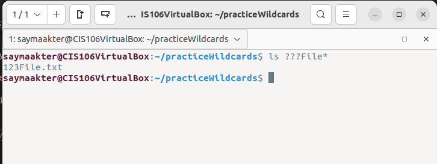
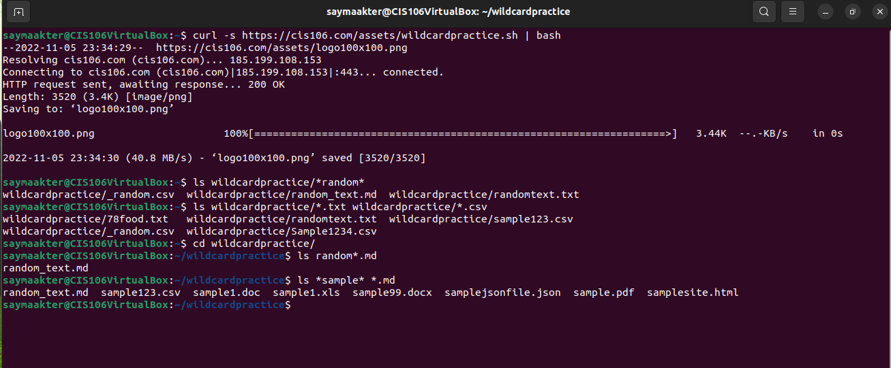
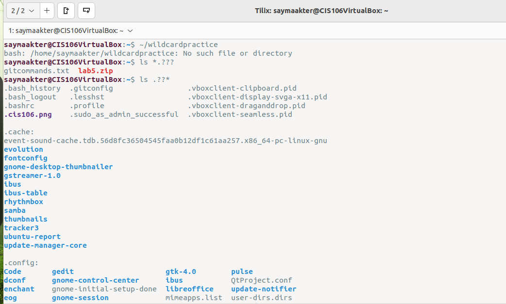
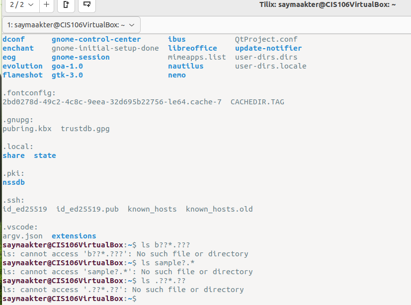
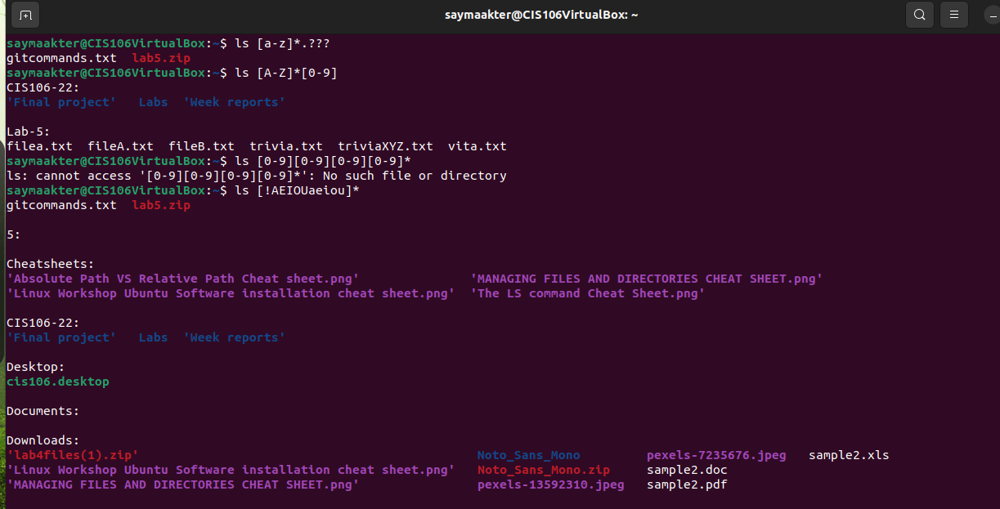
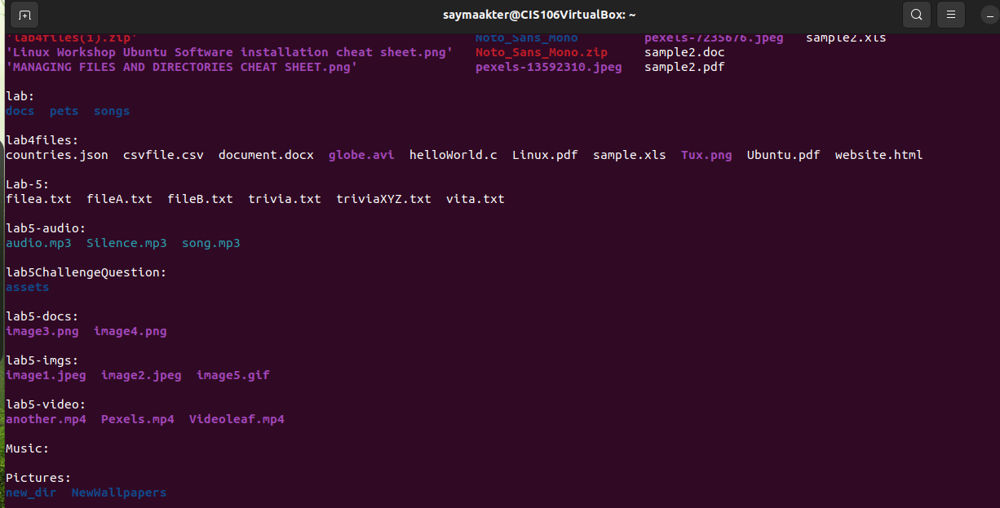
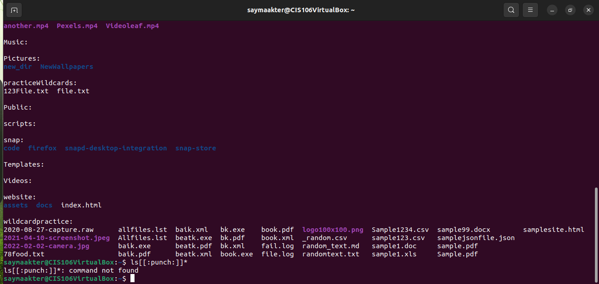

# Week Report 6

## Wildcards.

### * Wildcard
the * wildcard matches from 0 to any number of characters.
* Examples:
  * List all the text file in a directory
    * ` ls *.txt `
  * List all the files that start with the word file
    * ` ls file* `
  * Copy all the mp4 files
    * ` cp Downloads/*.mp4 ~/Videos/Movies/ `
  

### ? Wildcard
The ? wildcard matches a single character.
* Examples:
  * List all the files that have 3 characters and are followed by the word file in the name
  

### [] Wildcard 
The brackets wildcard match is a single character in a range 
* Examples:
  * To match all files that have a range of letters after f :
    * `  ls f[a-z]* `
  

### Brace Expansion
Brace expansion {} is not a wildcard but another feature of bash that allows you to generate arbitrary strings to use with commands.
* Examples:
  * To create a N number of files use:
    * ` touch file {A..Z}.txt `
  * To remove multiple files in a single directory
    * ` rm -r {dir1,dir2,dir3,file.txt,file.py} `
  
## Practice 
* Practice 5
  

* Practice 6

* Practice 7

