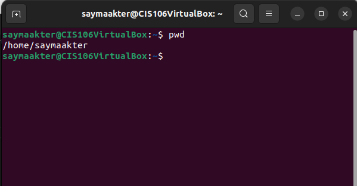
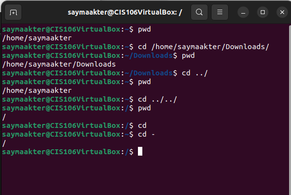

# Week Report 4

## Practice

## The Filesystem ( Some important Directories)

| Directory | Data Stored in Directory                                                                                                                      |
| --------- | --------------------------------------------------------------------------------------------------------------------------------------------- |
| bin       | Essential commands                                                                                                                            |
| dev       | Device files                                                                                                                                  |
| etc       | System configuration files                                                                                                                    |
| home      | User home directories                                                                                                                         |
| media     | Mount point for removal media, such as DVDs and floppy disks                                                                                  |
| opt       | Add-on software packages                                                                                                                      |
| proc      | Kernel information, process control, system hardware information                                                                              |
| srv       | Information relating to service that run on the system                                                                                        |
| usr       | Software not essential for system operation, such as applicants                                                                               |
| var       | Dedicated yp variable data, such as logs, database, websites, and temporary spool (e-mail etc.)  files that persist from one boot to the next |

## Commands to navigate the file system

| Command | What it does                                    | Syntax                              | Example           |
| ------- | ----------------------------------------------- | ----------------------------------- | ----------------- |
| pwd     | prints current working directory                | ` pwd `                             | ` pwd `           |
| cd      | changes the current working directory           | ` cd + destination `                | ` cd Downloads/ ` |
| ls      | displays all the files inside a given directory | ` ls + option + directory to list ` | ` man -a `        |

## Key terms 

*Definitions of the following term*

**File system** : the way files are stored and organized to simplify access to data

**Current directory**: the directory in which the user is currently working in

**parent directory** : a directory that is above another directory in the directory tree

**the difference between your home directory and the home directory** : your home directory is where you go to rest between work session, and your working directory is where you are right now

**pathname** : indicates the location of the file in the system ( like an address )

**relative path** : the location of a file starting from the current working directory or a directory that is located inside the current working directory 

**absolute path** : the location of a file starting a the root of the file system

**The commands are used for navigating the filesystem**
  * pwd
  * cd
  * ls
