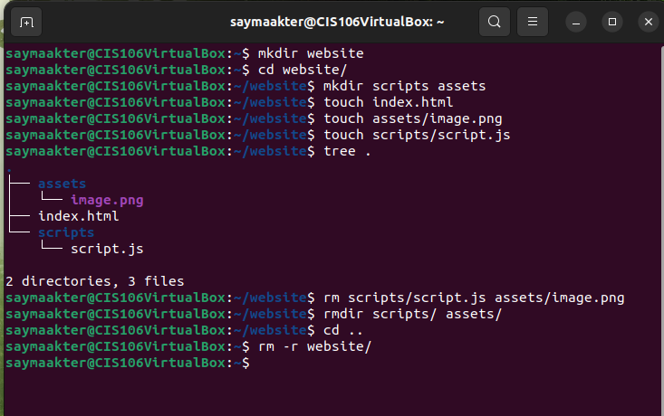
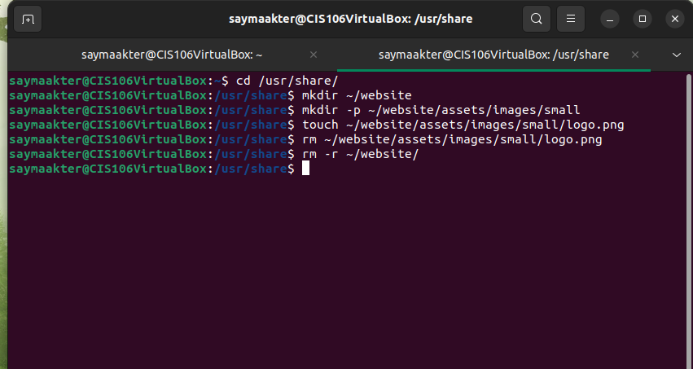
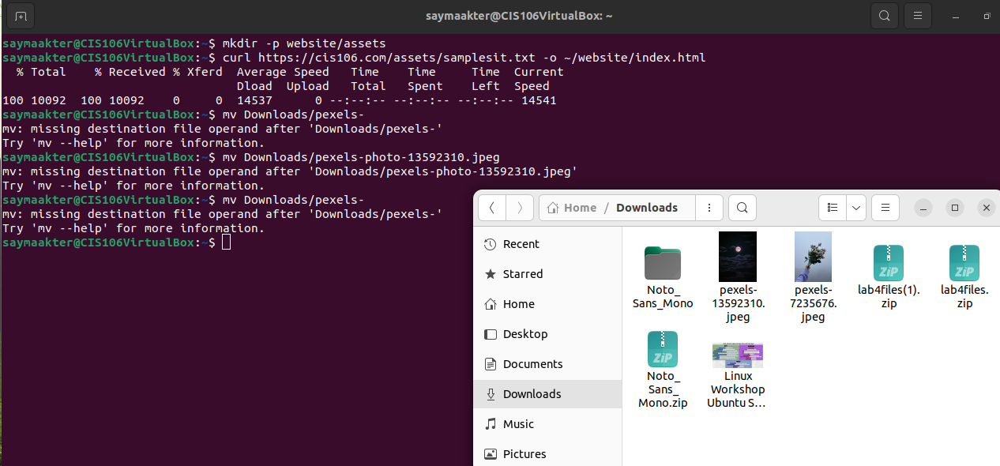
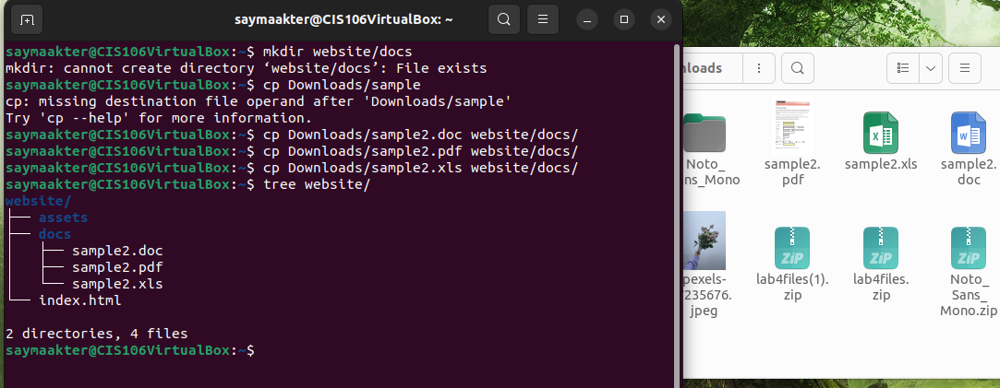

--- 
Name: Sayma Akter
Semester: Fall 22
Course: CIS106
---

# Week Report 5

## What are Command Options?
Command are often followed by options that modify/enhance their behavior

## What are Command Arguments?
Commands are also followed by arguments which are the items open which the command acts on 

## Which command is used for creating directories? Provide at least 3 examples.
The command used to create a directory is ` mkdir ` type: ` mkdir` + the name of the directory

## What does the touch command do? Provide at least 3 examples.
The touch command is used for creating files. For example, 
    To create a file called list, ` touch list `
    To create several files, ` touch list_of_cars.txt script.py names.csv `
    To create file using absolute path is ` touch ~/Downloads/games2.txt `

## How do you remove a file? Provide an example.
The example to remove a file is  ` rm list `

## How do you remove a directory and can you remove non-empty directories in Linux? Provide an example
To remove a directory the command is ` rm -I Downloads/games/* ` that will remove all the files inside a directory and ask before removing more than 3 files. 
Also you can remove an empty directory by simply typing the command ` rm -r Downloads/games `

## Explain the mv and cp command. Provide at least 2 examples of each
The mv command is to moves and renames directories. For example,
    The basic formula of the mv command is: ` mv + source + destination ` and 
    To move file from a directory to another relative path is ` mv Downloads/homework.pdf Documents/ `
    To move multiple directories/files to a different directory ` mv games / wallpapers / rockmusic / /media / student / flashdrive/ `

The cp command is to to make copies of files/directories from source to a destination 
     The cp command uses the same structure as the mv command ` cp + files to copy + destination `
     To copy directories you must use the -r option ` cp -r + directory to copy + destination `

## Practice
* Practice 1

* Practice 2

* Practice 3

* Practice 4

